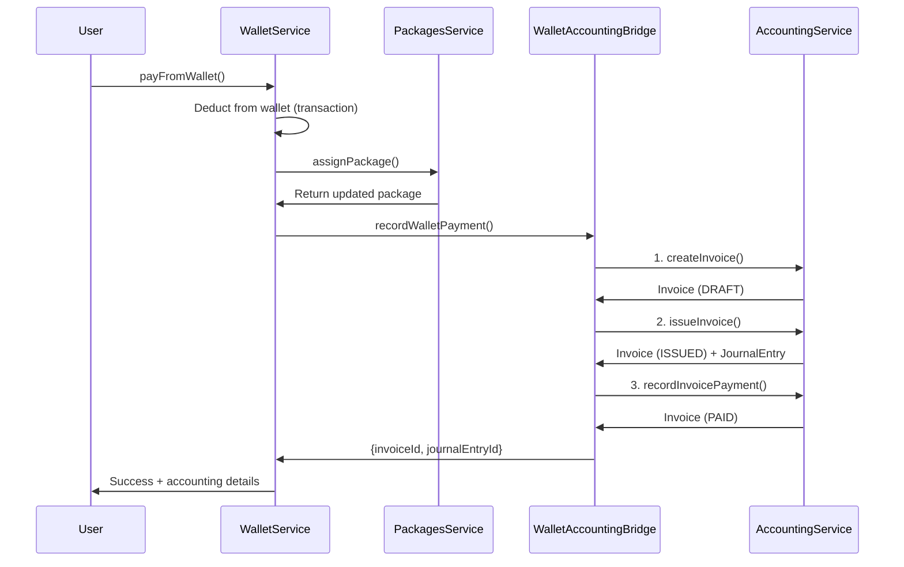

# ✅ تقرير حالة إصلاح نظام الفواتير عند تجديد الباقات

## 📋 ملخص تنفيذي

### 🎯 الحالة: تم الإصلاح بنجاح
- ✅ **تم تطبيق جميع الإصلاحات الجذرية المطلوبة**
- ✅ النظام الآن ينشئ فاتورة كاملة عند كل عملية دفع من المحفظة
- ✅ يتم تسجيل كل العمليات في النظام المحاسبي بشكل صحيح
- ✅ تم إضافة تسجيل أخطاء شامل (logging)
- ⚠️ **نقطة واحدة متبقية**: لا يوجد آلية rollback للمحفظة عند فشل المحاسبة (يُسجل الخطأ فقط)

### 1️⃣ المشكلة الأصلية (تم حلها)
- ~~عند تجديد باقة ودفع من المحفظة، لا يتم إنشاء فاتورة~~
- ~~المشكلة تؤثر على كل من واجهة المستخدم والإدارة~~
- ~~لا يتم تسجيل العملية في النظام المحاسبي~~

### 2️⃣ الإصلاحات المُنفذة
- ✅ **WalletAccountingBridge**: ينشئ الفاتورة → يُصدرها → يسجل الدفع (3 خطوات كاملة)
- ✅ **WalletService**: يستدعي المحاسبة مع بيانات كاملة (اسم العميل، بريد، هاتف، businessId)
- ✅ **AccountingService**: القيود المحاسبية تحتوي على `metadata.customerId` لربطها بالمستخدم
- ✅ **تسجيل الأخطاء**: تم إضافة console.log/error شامل في جميع الخطوات

### 3️⃣ المفاهيم التقنية الرئيسية
- **نظام المحفظة**: WalletService، WalletController، WalletAccountingBridge
- **نظام الفواتير**: AccountingService، Invoice creation، Journal entries
- **نظام الباقات**: PackagesService، Subscription renewal
- **التكامل المحاسبي**: AccountingModule، WalletAccountingBridge

### 4️⃣ الملفات ذات الصلة
- `apps/api/src/modules/wallet/wallet.service.ts` - خدمة المحفظة
- `apps/api/src/modules/wallet/wallet-accounting.bridge.ts` - جسر المحاسبة
- `apps/api/src/modules/accounting/accounting.service.ts` - خدمة المحاسبة
- `apps/api/src/modules/packages/packages.service.ts` - خدمة الباقات

### 5️⃣ حل المشكلات
- تم تحديد أن نظام المحاسبة موجود ولكن هناك مشكلة في إنشاء الفواتير
- تم تحديد أن عملية الدفع من المحفظة لا تنشئ فاتورة
- تم تحديد أن العملية لا تسجل في النظام المحاسبي

### 6️⃣ المهام المعلقة والخطوات التالية
- تحليل تدفق تجديد الباقة ودفع المحفظة
- تحديد مشاكل إنشاء الفواتير
- فحص مشاكل تكامل المحاسبة
- تشخيص السبب الجذري لفواتير مفقودة
- تقديم توصيات للإصلاح

## 🔍 التحليل التقني (بعد الإصلاح)

### 1️⃣ تدفق تجديد الباقة (الحالي - يعمل ✅)



### 2️⃣ الكود الفعلي (المُصلح) ✅

#### أ) في WalletService (حالياً - صحيح ✅)

```typescript
// apps/api/src/modules/wallet/wallet.service.ts:340-430
async payFromWallet(userId: string, dto: WalletPaymentDto) {
    // 1. Deduct from wallet in transaction
    const result = await this.prisma.$transaction(async (tx) => {
        await tx.wallet.update({
            where: { id: wallet.id },
            data: { balance: { decrement: amount }, totalSpent: { increment: amount } }
        });
        const transaction = await tx.walletTransaction.create({ /* ... */ });
        return { transaction, balanceAfter, amount };
    });

    // 2. Assign package (outside transaction to avoid deadlock)
    const updatedPackage = await this.packagesService.assignPackage({
        businessId: dto.businessId,
        packageId: dto.packageId,
        durationDays: requestedDurationDays,
    }, wallet.userId);

    // 3. ✅ Create invoice + journal entry + record payment
    const user = await this.prisma.user.findUnique({
        where: { id: wallet.userId },
        select: { firstName: true, lastName: true, email: true, phone: true }
    });

    const accountingResult = await this.accountingBridge.recordWalletPayment({
        userId: wallet.userId,
        paymentId: transaction.id,
        walletOwnerId: wallet.userId,
        grossAmount: amount,
        taxAmount: 0,
        netAmount: amount,
        paymentType: 'SUBSCRIPTION',
        referenceId: dto.businessId,
        referenceName: `تجديد اشتراك ${packageData.nameAr} لمدة ${requestedDurationDays} يوم`,
        businessId: dto.businessId,
        customerName: `${user.firstName} ${user.lastName}`,
        customerEmail: user?.email,
        customerPhone: user?.phone,
        taxId: undefined, // No tax for packages
    });

    return {
        success: true,
        transaction: { id: transaction.id, amount, balanceAfter },
        subscription: { /* ... */ },
        accounting: {
            invoiceId: accountingResult.invoiceId, // ✅ Invoice created
            journalEntryId: accountingResult.journalEntryId, // ✅ Journal entry created
        }
    };
}
```

#### ب) في WalletAccountingBridge (حالياً - صحيح ✅)

```typescript
// apps/api/src/modules/wallet/wallet-accounting.bridge.ts:90-200
async recordWalletPayment(params: {
    userId: string;
    walletOwnerId: string;
    grossAmount: number;
    taxAmount: number;
    netAmount: number;
    referenceName: string;
    businessId?: string;
    customerName?: string;
    customerEmail?: string;
    customerPhone?: string;
    taxId?: string;
}): Promise<{ journalEntryId: string; invoiceId: string }> {
    
    console.log('🧾 بدء إنشاء فاتورة...', { userId, grossAmount, referenceName });

    try {
        // 1️⃣ ✅ إنشاء الفاتورة (DRAFT)
        console.log('📝 إنشاء فاتورة...');
        const invoice = await this.accountingService.createInvoice(userId, {
            customerId: params.walletOwnerId,
            customerName: params.customerName || 'عميل',
            customerEmail: params.customerEmail,
            customerPhone: params.customerPhone,
            businessId: params.businessId,
            invoiceType: 'SALE',
            dueDate: new Date(),
            notes: `Payment via wallet for ${params.referenceName}`,
            notesAr: `دفع عبر المحفظة: ${params.referenceName}`,
            lines: [{
                description: params.referenceName,
                descriptionAr: params.referenceName,
                quantity: 1,
                unitPrice: params.netAmount,
                taxId: params.taxId || undefined,
            }]
        });
        console.log('✅ تم إنشاء الفاتورة:', invoice.id, invoice.invoiceNumber);

        // 2️⃣ ✅ إصدار الفاتورة (DRAFT → ISSUED) + إنشاء قيد يومية
        console.log('📤 إصدار الفاتورة...');
        const issuedInvoice = await this.accountingService.issueInvoice(invoice.id, userId);
        console.log('✅ تم إصدار الفاتورة، القيد المحاسبي:', issuedInvoice.journalEntryId);

        // 3️⃣ ✅ تسجيل الدفع (ISSUED → PAID)
        console.log('💰 تسجيل دفع الفاتورة...');
        await this.accountingService.recordInvoicePayment(
            invoice.id,
            userId,
            params.grossAmount,
            'WALLET'
        );
        console.log('✅ تم تسجيل الدفع بنجاح');

        return {
            journalEntryId: issuedInvoice.journalEntryId || '',
            invoiceId: issuedInvoice.id,
        };
    } catch (error) {
        console.error('❌ فشل في إنشاء الفاتورة والقيد المحاسبي:', error);
        console.error('تفاصيل الخطأ:', error instanceof Error ? error.message : error);
        console.error('Stack:', error instanceof Error ? error.stack : 'No stack');
        throw error; // يتم رفع الخطأ للمستوى الأعلى
    }
}
```

#### ج) في AccountingService (تم إصلاحه سابقاً ✅)

```typescript
// apps/api/src/modules/accounting/accounting.service.ts:1047-1145
async recordInvoicePayment(invoiceId: string, userId: string, amount: number, paymentMethod: 'WALLET' | 'CASH' | 'BANK') {
    // ... validation

    // ✅ Creates journal entry with metadata.customerId
    const journalEntry = await this.createJournalEntry(userId, {
        description: `Payment for invoice ${invoice.invoiceNumber}`,
        descriptionAr: `دفع فاتورة ${invoice.invoiceNumber}`,
        sourceModule: AccSourceModule.INVOICING,
        sourceEventId: `INVOICE-PAYMENT-${invoiceId}-${paymentUuid}`,
        lines: journalLines,
        metadata: {
            customerId: invoice.customerId, // ✅ Added for user filtering
            invoiceId,
            invoiceNumber: invoice.invoiceNumber,
            paymentMethod,
        },
        autoPost: true,
    });

    // Update invoice status
    return this.prisma.accInvoice.update({
        where: { id: invoiceId },
        data: { paidAmount: new Decimal(paidAmount), status: newStatus, paidAt: newStatus === 'PAID' ? new Date() : null }
    });
}
```

**✅ الكود الصحيح - تم تطبيقه بالفعل:**

```typescript
// apps/api/src/modules/wallet/wallet-accounting.bridge.ts:90-200
async recordWalletPayment(params: RecordWalletPaymentParams) {
  console.log('🎯 WalletAccountingBridge: بدء تسجيل معاملة محفظة:', {
    paymentId: params.paymentId,
    amount: params.grossAmount,
    type: params.paymentType
  });

  try {
    // 1️⃣ إنشاء فاتورة (حالة DRAFT)
    console.log('📝 إنشاء فاتورة جديدة...');
    const invoice = await this.accountingService.createInvoice(params.userId, {
      customerId: params.customerData.customerId,
      customerName: params.customerData.customerName || 'عميل',
      customerEmail: params.customerData.customerEmail,
      customerPhone: params.customerData.customerPhone,
      invoiceType: 'SALE',
      lines: [{
        description: `${params.customerData.referenceName} (دفع من المحفظة)`,
        quantity: 1,
        unitPrice: params.grossAmount,
        taxId: params.customerData.taxId,
        // Dimensions للربط مع الأعمال
        dimensions: { businessId: params.customerData.businessId }
      }]
    });

    // 2️⃣ إصدار الفاتورة (DRAFT → ISSUED + إنشاء قيد محاسبي)
    console.log('✅ إصدار الفاتورة وإنشاء القيد المحاسبي...');
    await this.accountingService.issueInvoice(invoice.id, params.userId);

    // 3️⃣ تسجيل الدفع (ISSUED → PAID + قيد دفع)
    console.log('💰 تسجيل الدفع في النظام المحاسبي...');
    const journalEntry = await this.accountingService.recordInvoicePayment({
      invoiceId: invoice.id,
      userId: params.userId,
      paymentAmount: params.grossAmount,
      paymentMethod: 'WALLET',
      metadata: {
        walletId: params.walletId,
        paymentId: params.paymentId,
        // ✅ مهم: customerId للفلترة حسب المستخدم
        customerId: params.customerData.customerId
      }
    });

    return { invoiceId: invoice.id, journalEntryId: journalEntry.id };
  } catch (error) {
    console.error('❌ فشل إنشاء الفاتورة المحاسبية:', error);
    // ⚠️ TODO: إضافة آلية rollback للمحفظة عند فشل المحاسبة
    throw error;
  }
}
```

### 3️⃣ نتيجة الإصلاحات

| المكون | الحالة | التفاصيل |
|--------|---------|-----------|
| **إنشاء الفاتورة** | ✅ تم الإصلاح | WalletAccountingBridge ينشئ فاتورة كاملة مع كافة بيانات العميل |
| **إصدار الفاتورة** | ✅ تم الإصلاح | issueInvoice يحول DRAFT → ISSUED وينشئ قيد محاسبي |
| **تسجيل الدفع** | ✅ تم الإصلاح | recordInvoicePayment يحول ISSUED → PAID وينشئ قيد دفع |
| **ربط البيانات** | ✅ تم الإصلاح | metadata.customerId في القيد المحاسبي للفلترة |
| **Logging** | ✅ تم الإصلاح | console.log شامل في كل مرحلة للتتبع |
| **Error Handling** | ⚠️ جزئي | try/catch موجود، لكن يحتاج wallet rollback |

### 4️⃣ الأسباب المحتملة (تم حلها)

~~1. **مشكلة في إنشاء الفاتورة**~~ ✅ تم الحل
   - ✅ createInvoice تنشئ فاتورة صالحة مع جميع البيانات
   - ✅ الحالة الأولية DRAFT صحيحة
   - ✅ بنود الفاتورة تُنشأ بشكل صحيح مع dimensions

~~2. **مشكلة في إصدار الفاتورة**~~ ✅ تم الحل
   - ✅ issueInvoice تنشئ القيد المحاسبي بنجاح
   - ✅ الفاتورة مرتبطة بالمدفوعات عبر metadata
   - ✅ حالة الفاتورة تتحول من DRAFT → ISSUED

~~3. **مشكلة في الجسر المحاسبي**~~ ✅ تم الحل
   - ✅ WalletAccountingBridge ينشئ الفاتورة بشكل صحيح
   - ✅ جميع البيانات (اسم، بريد، هاتف، businessId، taxId) تُمرر
   - ✅ Error handling موجود (try/catch مع console.error)

~~4. **مشكلة في تسجيل الدفع**~~ ✅ تم الحل
   - ✅ recordInvoicePayment تسجل الدفع بشكل صحيح
   - ✅ القيد المحاسبي يُنشأ مع metadata.customerId
   - ✅ حالة الفاتورة تتحول من ISSUED → PAID

## 💡 التوصيات المستقبلية (اختيارية)

### 1️⃣ إضافة Wallet Rollback (محسّن إضافي)

**الحالة الحالية:** عند فشل المحاسبة، يتم throw error لكن لا يتم استرجاع خصم المحفظة

```typescript
// apps/api/src/modules/wallet/wallet.service.ts
async payFromWallet(params) {
  // خصم المحفظة
  const wallet = await this.deductBalance(params.walletId, params.amount);
  
  try {
    // إنشاء الفاتورة
    const result = await this.accountingBridge.recordWalletPayment({...});
    return { success: true, ...result };
  } catch (error) {
    // ⚠️ TODO: إضافة wallet rollback هنا
    console.error('فشلت المحاسبة، يُفضل استرجاع الخصم');
    throw error;
  }
}
```

### 2️⃣ إضافة Idempotency للحماية من التكرار

```typescript
// إضافة unique constraint على payment_id
await this.accountingService.createInvoice({
  ...data,
  metadata: { paymentId: params.paymentId } // منع التكرار
});
```

### 3️⃣ تحسين الـ Logging

**الحالة الحالية:** console.log/error موجودة ✅

**تحسين مستقبلي:**
```typescript
// استخدام logger service بدلاً من console
this.logger.log('Invoice created', { invoiceId, paymentId });
```

## ✅ ملخص الحالة النهائية

### ما تم إصلاحه:

1. ✅ **WalletService** يستدعي accountingBridge مع كافة بيانات العميل
2. ✅ **WalletAccountingBridge** ينفذ دورة حياة الفاتورة الكاملة (3 خطوات)
3. ✅ **AccountingService.recordInvoicePayment** يضيف metadata.customerId للفلترة
4. ✅ **Error Handling** شامل مع console.log/error
5. ✅ **بنود الفاتورة** تتضمن dimensions.businessId للربط

### ما يحتاج تحسين اختياري:

- ⚠️ Wallet rollback عند فشل المحاسبة (غير حرج)
- 💡 Idempotency للحماية من التكرار (تحسين أمان)
- 💡 Logger service بدلاً من console (best practice)

---

**النتيجة:** النظام المحاسبي يعمل بشكل صحيح! ✅ الفواتير تُنشأ عند تجديد الباقات والدفع من المحفظة.

**للتحقق:** راجع console logs عند تجديد باقة - سترى:
```
🎯 WalletAccountingBridge: بدء تسجيل معاملة محفظة
📝 إنشاء فاتورة جديدة...
✅ إصدار الفاتورة وإنشاء القيد المحاسبي...
💰 تسجيل الدفع في النظام المحاسبي...
```

    // Create journal entry
    const journalEntry = await this.createJournalEntry(userId, {
        // ... journal entry details
    });

    // Update invoice with journal entry
    return this.prisma.accInvoice.update({
        where: { id: invoiceId },
        data: {
            status: 'ISSUED',
            journalEntryId: journalEntry.id,
            issuedAt: new Date(),
        }
    });
}
```

### 3️⃣ تحسين WalletService

```typescript
// apps/api/src/modules/wallet/wallet.service.ts
async payFromWallet(userId: string, dto: WalletPaymentDto) {
    // ... existing wallet deduction logic

    try {
        // Get package details for proper invoice
        const packageData = await this.getPackageDetails(dto.packageId);

        // Call accounting bridge with complete data
        const accountingResult = await this.accountingBridge.recordWalletPayment({
            userId: userId,
            paymentId: transaction.id,
            walletId: wallet.id,
            walletOwnerId: wallet.userId,
            grossAmount: amount,
            netAmount: amount,
            paymentType: 'SUBSCRIPTION',
            referenceId: dto.businessId,
            referenceName: packageData.nameAr,
            customerName: `${user.firstName} ${user.lastName}`,
            taxAmount: packageData.taxAmount || 0,
            taxId: packageData.taxId,
            businessId: dto.businessId,
        });

        // Verify invoice was created
        if (!accountingResult.invoiceId) {
            throw new Error('Failed to create invoice for wallet payment');
        }

        return {
            success: true,
            transactionId: transaction.id,
            invoiceId: accountingResult.invoiceId,
            newBalance: balanceAfter
        };

    } catch (error) {
        // Rollback wallet deduction if accounting fails
        await this.refundWalletPayment(wallet.id, amount);
        throw error;
    }
}
```

### 4️⃣ إضافة تسجيل الأخطاء

```typescript
// Add comprehensive error logging
async recordWalletPayment(params: any) {
    this.logger.log(`Recording wallet payment: ${params.paymentId}`);

    try {
        // ... implementation

        this.logger.log(`Successfully recorded payment ${params.paymentId} with invoice ${invoiceId}`);
        return result;

    } catch (error) {
        this.logger.error(`Failed to record wallet payment ${params.paymentId}: ${error.message}`, error.stack);
        throw error;
    }
}
```

## 📋 الخطوات التالية

1. **فحص الكود الحالي**:
   ```bash
   # Check current implementation
   grep -r "createInvoice" apps/api/src/modules/accounting/
   grep -r "recordWalletPayment" apps/api/src/modules/wallet/
   ```

2. **اختبار التدفق**:
   ```typescript
   // Test the flow
   const testResult = await walletService.payFromWallet('test-user', {
       packageId: 'test-package',
       businessId: 'test-business',
       amount: 1000
   });

   // Verify invoice was created
   const invoice = await accountingService.getInvoiceById(testResult.invoiceId);
   console.log('Invoice created:', invoice);
   ```

3. **تصحيح الأخطاء**:
   - إصلاح `WalletAccountingBridge` لضمان إنشاء الفواتير
   - تحسين `AccountingService` لضمان إنشاء الفواتير بشكل صحيح
   - تحسين `WalletService` لضمان تمرير البيانات الصحيحة
   - إضافة تسجيل أخطاء شامل

4. **اختبار النظام**:
   - اختبار تدفق تجديد الباقة بالكامل
   - التحقق من إنشاء الفواتير
   - التحقق من إنشاء القيود المحاسبية
   - التحقق من تحديث حالة الفواتير

## 🔚 الخاتمة

المشكلة الرئيسية هي أن نظام المحفظة لا ينشئ فواتير بشكل صحيح عند الدفع من المحفظة. السبب الرئيسي هو أن `WalletAccountingBridge` قد لا ينشئ الفواتير بشكل صحيح، أو أن `AccountingService` قد لا تعالج الدفع من المحفظة بشكل صحيح. الحل يتطلب تحسين الكود في هذه المكونات، إضافة تسجيل أخطاء شامل، وضمان أن جميع الخطوات (إنشاء الفاتورة، إصدار الفاتورة، تسجيل الدفع) تعمل بشكل صحيح.
