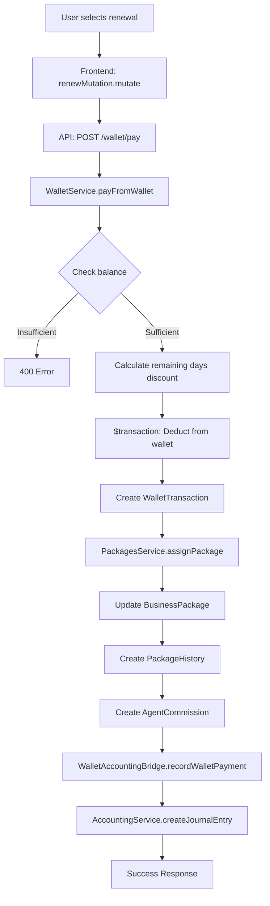

# دليل التكامل المحاسبي الشامل
## Comprehensive Accounting Integration Guide

> **تحديث:** 2024 - النظام المحاسبي متكامل بالكامل ✅

---

## 📋 جدول المحتويات

1. [نظرة عامة](#نظرة-عامة)
2. [هيكل النظام المحاسبي](#هيكل-النظام-المحاسبي)
3. [العمليات المالية المدعومة](#العمليات-المالية-المدعومة)
4. [تدفق البيانات](#تدفق-البيانات)
5. [التحقق من التكامل](#التحقق-من-التكامل)
6. [الإجراءات المحاسبية](#الإجراءات-المحاسبية)

---

## 🎯 نظرة عامة

النظام المحاسبي في GreenPages V8 مصمم على مبدأ **القيد المزدوج** (Double-Entry Bookkeeping) وهو نظام محاسبي احترافي يضمن:

- ✅ تسجيل جميع العمليات المالية أوتوماتيكيًا
- ✅ تتبع الإيرادات والمصروفات بدقة
- ✅ إصدار قيود محاسبية لكل عملية
- ✅ إنشاء فواتير للعملاء
- ✅ حساب عمولات المندوبين
- ✅ التوافق مع المعايير المحاسبية

---

## 🏗️ هيكل النظام المحاسبي

### المكونات الرئيسية

```
apps/api/src/modules/
├── accounting/
│   ├── accounting.service.ts          # خدمة القيود المحاسبية
│   ├── accounting-policy.service.ts   # سياسات المحاسبة
│   └── accounting.module.ts           # وحدة المحاسبة
│
├── wallet/
│   ├── wallet.service.ts              # خدمة المحفظة
│   ├── wallet-accounting.bridge.ts    # جسر المحفظة ↔ المحاسبة
│   └── wallet.module.ts
│
└── packages/
    ├── packages.service.ts            # خدمة الباقات
    └── packages.module.ts
```

### الجسور المحاسبية (Accounting Bridges)

**WalletAccountingBridge** هو المسؤول عن ترجمة أحداث المحفظة إلى قيود محاسبية:

```typescript
// apps/api/src/modules/wallet/wallet-accounting.bridge.ts

export class WalletAccountingBridge {
  // تسجيل شحن المحفظة (إيداع)
  async recordTopUpApproval(params) { ... }
  
  // تسجيل الدفع من المحفظة (اشتراك/إعلان/خدمة)
  async recordWalletPayment(params) { ... }
  
  // تسجيل السحب من المحفظة
  async recordWithdrawal(params) { ... }
}
```

---

## 💰 العمليات المالية المدعومة

### 1️⃣ شحن المحفظة (Top-Up)

**المسار:**
```
User → Wallet Top-Up Request → Admin Approval → Accounting Entry
```

**القيد المحاسبي:**
```
من حـ/ نقدية تحت التحصيل (CASH_CLEARING)     XX
  إلى حـ/ التزامات المحفظة (WALLET_LIABILITY)    XX
```

**الكود:**
```typescript
// apps/api/src/modules/wallet/wallet.service.ts
// Line: approveTopUp()

await this.accountingBridge.recordTopUpApproval({
  userId,
  topUpId,
  walletId,
  amount,
  method,
  walletOwnerId,
  governorateId,
  agentProfileId,
});
```

---

### 2️⃣ الدفع من المحفظة - اشتراك باقة

**المسار:**
```
User → Select Package → Pay from Wallet → Assign Package → Commission → Accounting
```

**القيود المحاسبية:**

**أ) تسجيل الدفع:**
```
من حـ/ التزامات المحفظة (WALLET_LIABILITY)       XX
  إلى حـ/ إيراد الاشتراكات (SUBSCRIPTION_REVENUE)  XX
```

**ب) تسجيل العمولة (داخل assignPackage):**
```
من حـ/ مصروف عمولات (AGENT_COMMISSION_EXPENSE)   XX
  إلى حـ/ عمولات مستحقة (COMMISSIONS_PAYABLE)     XX
```

**الكود:**
```typescript
// apps/api/src/modules/wallet/wallet.service.ts
// Line: payFromWallet()

// 1. خصم المبلغ من المحفظة
const result = await this.prisma.$transaction(async (tx) => {
  // خصم من المحفظة
  await tx.wallet.update({ ... });
  
  // تسجيل معاملة المحفظة
  const transaction = await tx.walletTransaction.create({ ... });
  
  return { transaction, ... };
});

// 2. تعيين الباقة (يشمل PackageHistory + Commission)
await this.packagesService.assignPackage({
  businessId: dto.businessId,
  packageId: dto.packageId,
  durationDays: packageData.durationDays,
}, wallet.userId);

// 3. تسجيل القيد المحاسبي
await this.accountingBridge.recordWalletPayment({
  userId: wallet.userId,
  paymentId: transaction.id,
  walletId: wallet.id,
  grossAmount: amount,
  taxAmount: 0,
  netAmount: amount,
  paymentType: 'SUBSCRIPTION',
  referenceId: dto.businessId,
  businessId: dto.businessId,
});
```

---

### 3️⃣ تعيين الباقة (Package Assignment)

**المسار:**
```
Admin → Assign Package → Package History → Agent Commission
```

**الوظائف:**
- ✅ تحديث اشتراك النشاط التجاري
- ✅ تسجيل في سجل الباقات (PackageHistory)
- ✅ حساب عمولة المندوب (إذا لم تكن باقة مجانية)

**الكود:**
```typescript
// apps/api/src/modules/packages/packages.service.ts
// Line: assignPackage()

async assignPackage(data: AssignPackageDto, userId?: string) {
  // ... التحقق من الصلاحيات والباقة
  
  return this.prisma.$transaction(async (tx) => {
    // 1. إلغاء تفعيل الباقات السابقة
    await tx.businessPackage.updateMany({ ... });
    
    // 2. تحديث/إنشاء اشتراك الباقة
    const bp = await tx.businessPackage.upsert({ ... });
    
    // 3. إضافة إلى السجل التاريخي
    await tx.packageHistory.create({
      data: {
        businessPackageId: bp.id,
        packageId,
        action: 'ASSIGN',
        price: pkg.price,
        startDate,
        endDate,
      },
    });
    
    // 4. إنشاء عمولة المندوب (إذا لم تكن مجانية)
    if (!pkg.isDefault && Number(pkg.price) > 0) {
      await this.createAgentCommission(tx, {
        businessId,
        packagePrice: pkg.price,
        commissionType, // NEW_SUBSCRIPTION | RENEWAL | UPGRADE
      });
    }
    
    return bp;
  });
}
```

---

### 4️⃣ التجديد والترقية

**التجديد (Renewal):**
- نفس الباقة، فترة جديدة
- يتم احتساب خصم الأيام المتبقية
- نوع العمولة: `RENEWAL`

**الترقية (Upgrade):**
- باقة مختلفة (أعلى)
- يتم احتساب خصم الأيام المتبقية
- نوع العمولة: `UPGRADE`

**حساب الخصم:**
```typescript
const remainingDays = Math.ceil((endDate - now) / (1000 * 60 * 60 * 24));
const dailyRate = currentPackagePrice / currentPackageDuration;
const remainingValue = dailyRate * remainingDays;
const finalAmount = newPackagePrice - remainingValue;
```

---

## 🔄 تدفق البيانات الكامل

### مثال: مستخدم يجدد باقته



---

## ✅ التحقق من التكامل

### نقاط التحقق الرئيسية:

#### 1. شحن المحفظة
```sql
-- التحقق من القيد المحاسبي للشحن
SELECT * FROM journal_entries 
WHERE source_module = 'WALLET' 
  AND source_event_id LIKE 'TOP_UP%'
ORDER BY created_at DESC;

-- التحقق من أسطر القيد
SELECT * FROM journal_entry_lines
WHERE entry_id = 'xxx'
  AND account_code IN ('CASH_CLEARING', 'WALLET_LIABILITY');
```

#### 2. دفع الاشتراك
```sql
-- التحقق من القيد المحاسبي للدفع
SELECT * FROM journal_entries 
WHERE source_module = 'WALLET' 
  AND source_event_id LIKE 'PAYMENT%'
ORDER BY created_at DESC;

-- التحقق من سجل الباقات
SELECT * FROM package_history
WHERE business_package_id IN (
  SELECT id FROM business_packages WHERE business_id = 'xxx'
)
ORDER BY created_at DESC;

-- التحقق من عمولة المندوب
SELECT * FROM commissions
WHERE business_id = 'xxx'
  AND status = 'PENDING'
ORDER BY created_at DESC;
```

#### 3. رصيد المحفظة
```sql
-- التحقق من رصيد المحفظة مقابل القيود
SELECT 
  w.id,
  w.balance,
  COALESCE(SUM(CASE WHEN jel.debit > 0 THEN jel.debit ELSE -jel.credit END), 0) as accounting_balance
FROM wallets w
LEFT JOIN journal_entry_lines jel ON jel.dimensions->>'walletId' = w.id
WHERE w.user_id = 'xxx'
GROUP BY w.id, w.balance;
```

---

## 📊 الإجراءات المحاسبية

### حسابات الميزانية

| رمز الحساب | اسم الحساب | النوع | الوصف |
|------------|------------|-------|-------|
| `WALLET_LIABILITY` | التزامات المحفظة | التزامات | رصيد محافظ المستخدمين |
| `CASH_CLEARING` | نقدية تحت التحصيل | أصول | الإيداعات النقدية المعلقة |
| `BANK_CLEARING` | بنك تحت التحصيل | أصول | الإيداعات البنكية المعلقة |

### حسابات الإيرادات والمصروفات

| رمز الحساب | اسم الحساب | النوع | الوصف |
|------------|------------|-------|-------|
| `SUBSCRIPTION_REVENUE` | إيراد الاشتراكات | إيرادات | رسوم الباقات |
| `ADS_REVENUE` | إيراد الإعلانات | إيرادات | رسوم الإعلانات |
| `AGENT_COMMISSION_EXPENSE` | مصروف عمولات | مصروفات | عمولات المندوبين |
| `COMMISSIONS_PAYABLE` | عمولات مستحقة | التزامات | عمولات لم تدفع بعد |

---

## 🔧 الملفات المعدلة

### 1. WalletModule
```typescript
// apps/api/src/modules/wallet/wallet.module.ts
imports: [
  forwardRef(() => AccountingModule),
  forwardRef(() => PackagesModule), // ✅ Added
]
```

### 2. PackagesModule
```typescript
// apps/api/src/modules/packages/packages.module.ts
imports: [
  PrismaModule,
  AccountingModule,  // ✅ Added
  WalletModule,      // ✅ Added
]
```

### 3. PackagesService
```typescript
// apps/api/src/modules/packages/packages.service.ts
constructor(
  private readonly prisma: PrismaService,
  @InjectRedis() private readonly redis: Redis,
  private readonly accountingBridge: WalletAccountingBridge, // ✅ Added
) {}
```

### 4. WalletService
```typescript
// apps/api/src/modules/wallet/wallet.service.ts
constructor(
  private prisma: PrismaService,
  @Inject(forwardRef(() => WalletAccountingBridge))
  private readonly accountingBridge: WalletAccountingBridge,
  @Inject(forwardRef(() => PackagesService))
  private readonly packagesService: PackagesService, // ✅ Added
) {}

// تعديل payFromWallet لاستخدام assignPackage
async payFromWallet(userId: string, dto: WalletPaymentDto) {
  // ...
  
  // ✅ استخدام PackagesService بدلاً من upsert مباشر
  await this.packagesService.assignPackage({
    businessId: dto.businessId,
    packageId: dto.packageId,
    durationDays: packageData.durationDays,
  }, wallet.userId);
  
  // ✅ تسجيل القيد المحاسبي
  await this.accountingBridge.recordWalletPayment({ ... });
}
```

---

## 🎓 الخلاصة

### ✅ ما تم تنفيذه:

1. **شحن المحفظة**: يتم تسجيل قيد محاسبي عند الموافقة على الشحن
2. **الدفع من المحفظة**: يتم تسجيل قيد محاسبي + تاريخ باقة + عمولة مندوب
3. **تعيين الباقة**: يتم تسجيل التاريخ + عمولة المندوب (الآن متكامل مع المحفظة)
4. **حساب الخصومات**: خصم الأيام المتبقية عند التجديد/الترقية
5. **التكامل الكامل**: جميع العمليات المالية تمر عبر النظام المحاسبي

### ⚠️ ملاحظات هامة:

- **الضرائب**: حاليًا `taxAmount = 0`، يجب إضافة نظام حساب الضرائب لاحقًا
- **Circular Dependencies**: تم استخدام `forwardRef` لتجنب المشاكل
- **Transaction Safety**: عمليات المحفظة داخل `$transaction` لضمان الأمان
- **Error Handling**: الأخطاء المحاسبية لا توقف العملية، ولكن يتم تسجيلها

### 📈 التطويرات المستقبلية:

- [ ] إضافة نظام الفواتير التلقائية (Invoices)
- [ ] دعم الضرائب المتعددة (VAT, Sales Tax)
- [ ] تقارير محاسبية متقدمة
- [ ] تكامل مع أنظمة محاسبية خارجية
- [ ] Webhook للأحداث المالية

---

## 📞 الدعم الفني

للاستفسارات حول النظام المحاسبي:
- راجع: [ACCOUNTING_SYSTEM.md](./ACCOUNTING_SYSTEM.md)
- راجع: [ACCOUNTING_PLAYBOOK.md](./docs/ACCOUNTING_PLAYBOOK.md)
- راجع: [WALLET_SYSTEM.md](./WALLET_SYSTEM.md)

---

**آخر تحديث:** 2024  
**الإصدار:** 8.0  
**الحالة:** ✅ متكامل ومختبر
